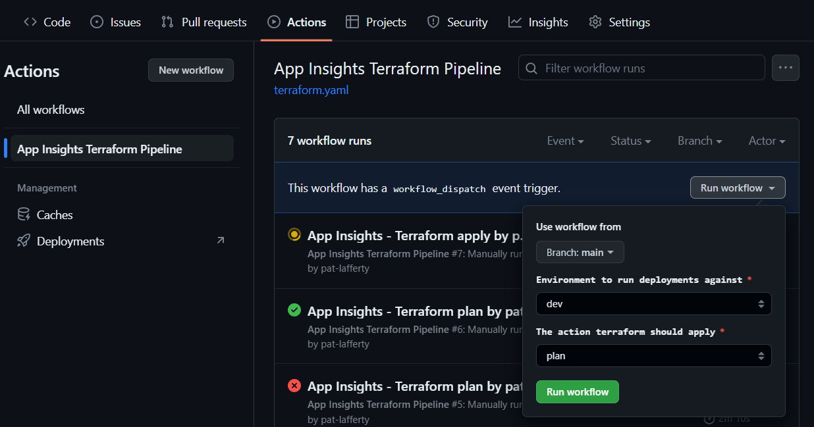

# IaC Repo

## How to Run

This repo uses a `workflow_dispatch` trigger, which requires a manual run step. 
Run this Terraform via a GitHub Actions pipeline by navigating to Actions, finding the name of the pipeline you want to run and selecting the branch, environment and terraform action you want:

